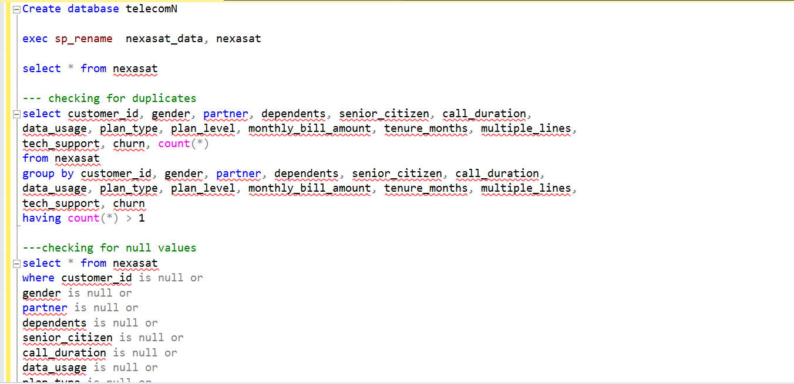
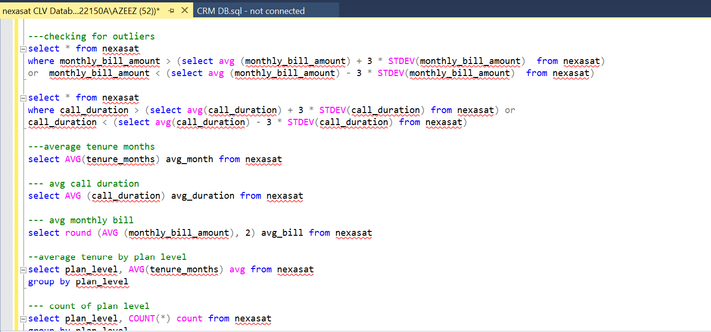
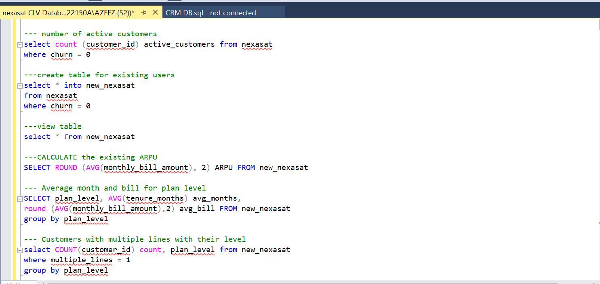
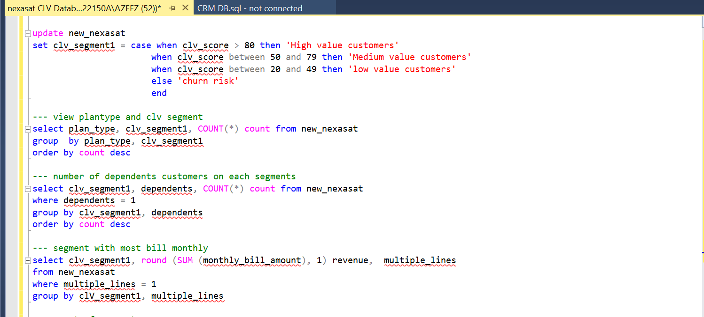
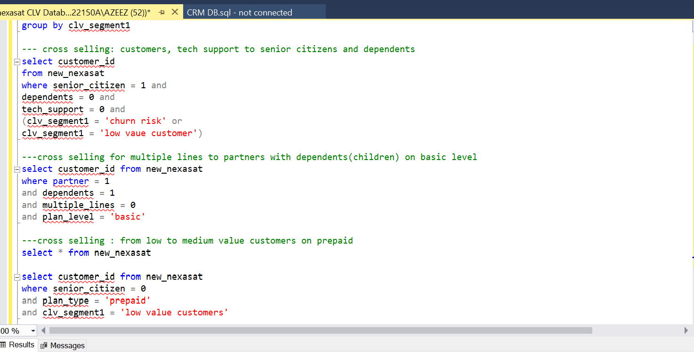

# Analysis-on-CLV-for-Nexasat-telecom
# Telecom Growth Strategies: Unlocking Customer Lifetime Value Through Smart Segmentation
Tools used: SQL server. 
## About the project
As a Data Analyst for NexaSat, I have been tasked with implementing Customer Lifetime Value (CLV) segmentation to drive strategic revenue growth through targeted up-selling and cross-selling initiatives. The purpose of this project is to enable stakeholders to identify high-opportunity customer segments, customize service offerings, and optimize marketing strategies.
## Project overview: 
The company has also identified an untapped potential within their existing customer base, recognizing that personalized offers and bundled services could significantly increase average revenue per user (ARPU). However, the challenge lies in identifying which customers are most receptive to these opportunities, as well as crafting offers that aligns with their preferences and usage patterns. 
## About the datasets
The data consists of 7,403 rows and 14 columns which include the gender, marital status, monthly amount of bill, data usage, identity of customer (senior citizen), plan type and the churn rate of the customers in NexaSat. 
## Data cleaning and transformation: 
The dataset was already cleaned, no null values or duplicates found just little adjustment after detecting outliers from the monthly bill amount and data usage columns.
## Encounter outliers:
The outliers were detected using the +3 or -3 with the standard deviation (STDEV) function using the SQL server.  12 rows were detected and were transformed. The transformed outliers were inputted into a new table using the ‘CREATE VIEW’ alongside other columns. 
## Analysis: 
The following are the insights generated from the reports
Key performance indicators (KPI):
•	Total customers: 7,043
•	Total male customers: 3,555
•	Total female customers: 3,488
•	Prepaid customers: 2,940
•	Postpaid customers: 4,103
•	Average monthly bill amount: $149.77
•	Average data usage: 8.8GB
•	Average call duration: 240 seconds 
•	Average tenure month: 24

  

### Detailed insight and analysis
1.	Analysis of active customers: I analyzed the remaining customers remaining after churn and it equaled 4272
New table was created from the active customer analysis. 
2.	Average Revenue per user (ARPU): the ARPU can be calculated in two ways total revenue/total users or average of the monthly bills, the average calculated is 157.53   
3.	What is the average bill and tenure for plan level:
There are two plan level; Basic and premium, for basic the average tenure and monthly bill are 13 and 119.35 respectively while for the Premium level, the average tenure and monthly bill is 33 and 173.45
4.	What is the number of customers on multiple lines on plan level:
The number of plan level on multiple lines on plan level were analyzed, Basic customers with multiple lines are 524 and Premium customers with multiple lines are 3015
5.	Plan type with the most revenue:
Postpaid customers contributed most to the revenue with a total of $427,338.15 while Prepaid customers generated $245,636 to the Nexasat revenue. 
6.	Average tenure month by plan level : Basic customers have an average tenure months of 16 months while the premium subscribers have an average month of 32 months   
 
7.	Monthly bill amount generated by both genders
The total amount generated by NexaSat monthly is $1,054,807.92, the male gender contributed $535,784.58 while the other gender contributed a total of $519,023.34 monthly.
Customer lifetime value was calculated as well to know how valuable the customers are to the company and their experience so far with the firm and to know how to improve the firm customer service from the CLV calculation.
**** 

The calculation was added as a new column to the new table created from the active customers. 
CLV = MONTHLY BILL AMOUNT * TENURE AMOUNT 
CLV SCORE was calculated from the sum of the 40% of monthly bill amount, 10% of data usage, 10% of tenure months and the 10% of the plan level of Premium.
I went on to classify the most valuable customers from the CLV score. 
For high valued customers, the CLV score is greater than 80, the medium value customers is between 50 and 80,
the low value customers is between 20 and 50 while the churn rate is less than 20.
 

## Analysis of the segment:
9.	Count of customers on plan type based on segments: 
Medium value customers have the most users on prepaid with 1,612 second by high value users on postpaid plan with 1,148 followed by medium value users on postpaid plan with 515 while we have low value users on both prepaid and postpaid with 485 and 466 respectively and customers who are on the verge of leaving is 46 on postpaid plan.  
10.	Number of dependents customer on each segment:
The medium segment has the highest number of dependents, such as children or family members, with a total of 606 dependents. In comparison, the high-value segment has 345 dependents, while the low-value segment and churn risk customers have 319 and 14 dependents, respectively.
11.	Customers segment with the most revenue:
The analysis of customer segments based on CLV (Customer Lifetime Value) and revenue from users with multiple lines reveals key insights into their contributions. High-value customers, generating $263,611, are the most profitable, highlighting the importance of targeted retention strategies. Medium-value customers also contribute significantly with $257,437, suggesting potential for cross-selling and personalized marketing. Low-value customers, with $48,036 in revenue, show hidden potential for upselling, while churn risk customers, generating only $3,631, require critical attention to prevent revenue loss. Overall, a strategic focus on enhancing customer segmentation, personalized marketing, and retention efforts can optimize revenue and foster long-term loyalty across all segments. The total revenue from users with multiple lines is $572,716, emphasizing the value of tailored strategies to maximize customer lifetime value and engagement
1

### Cross selling and up selling for users: 
-	Senior citizen without tech support and dependents at churn risk: we have 5 customers who are the risk of leaving the company. Introduce a cheaper tech support or low bundle for tech support that will improve their customer experience with Nexasat. For the churn risk users Focus on retention strategies and offer incentives to stay with the company. Consider loyalty programs or exclusive discounts. 
-	Cross selling for multiple lines to partners with dependents(children) on basic level: 
The analysis identifies a significant cross-selling opportunity among partners with dependents who are currently on a basic plan and do not utilize multiple lines. 208 users are without multiple lines. There should be a special package for families with dependents for multiple lines to encourage more purchase. Provide incentives such as discounts on the first few months of service, loyalty points, or exclusive promotions for existing customers upgrading to multiple lines.
-	up selling high clv customers from basic to premium
This report analyzes the current distribution of high CLV customers with a basic plan and provides strategic recommendations for upselling them to a premium plan. Upselling high CLV customers from a basic to a premium plan offers a lucrative opportunity to enhance revenue and strengthen customer relationships. By implementing targeted marketing strategies, personalized communication, and robust customer support, NexaSat can effectively transition these customers, maximizing their value and fostering long-term loyalty. This strategic approach not only increases profitability but also solidifies NexaSat's reputation as a customer-centric provider in the telecommunications industry.

# Conclusion 
The analysis of NexaSat's customer data reveals significant opportunities for revenue growth through targeted upselling and cross-selling strategies. High CLV customers, especially those currently on basic plans, represent a prime segment for upselling due to their demonstrated loyalty and substantial revenue contributions. NexaSat can effectively increase Average Revenue Per User (ARPU) and strengthen customer loyalty, which is crucial for maintaining a competitive edge in the telecommunications market.
# Recommendation
-	Develop personalized marketing campaigns aimed at high-value customers currently on basic plans. Highlight the enhanced features and exclusive benefits of upgrading to a premium plan. 
-	Focus on cross-selling products and services that cater to senior citizens, such as easy-to-use tech support packages or family plans that include multiple lines

